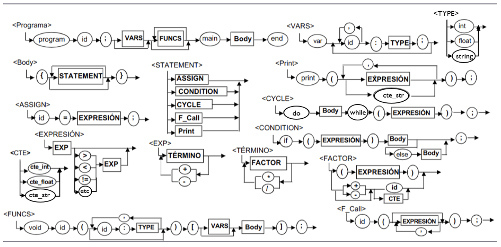

# LittleDuck Compiler
Compiler for the mini language "Little Duck"

## Instructions to Run the Code

### Prerrequisites
- Python 3.x
- PLY library

### Execution
1. Upload your source file with the name `test.txt` in the project directory
2. Execute the program with the command `python main.py`. This will run the parser with the input file, which internally uses the lexer (tokenizer.py) to generate the token stream. The parser then performs syntactic and semantic analysis, producing as output the quads, variable counters, and constant memory addresses, which are written to input_vm.txt. Finally, the virtual machine reads said output and executes the instructions.
